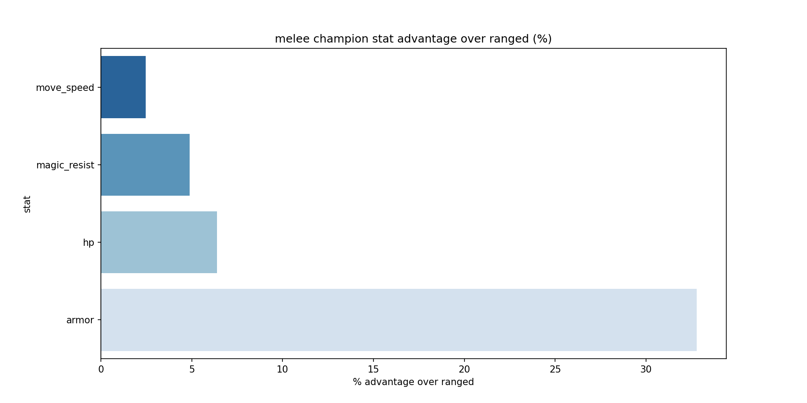
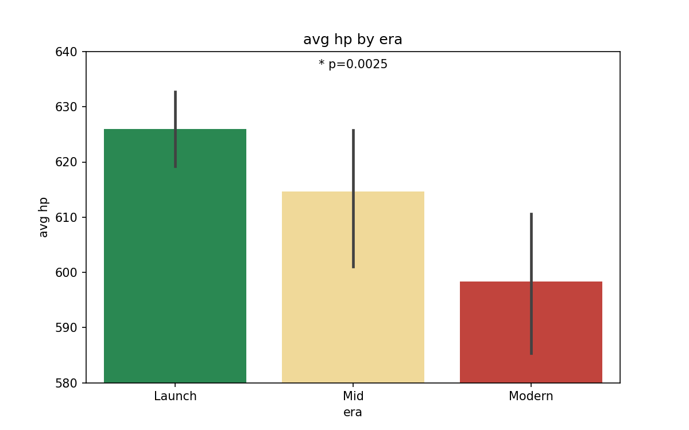
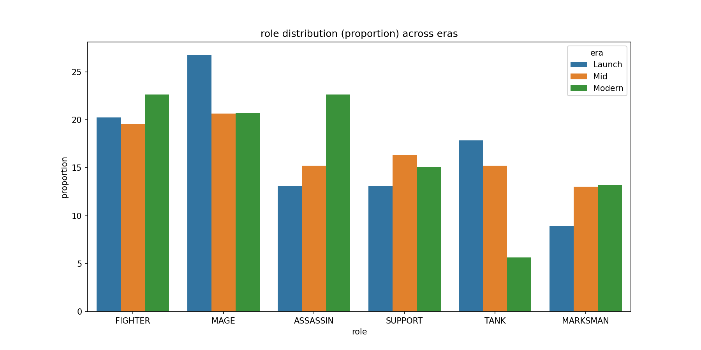

# League of Legends Champion Design Evolution: A Data Analysis
An end-to-end data pipeline exploring how League of Legends champion design has evolved since 2009, analyzing base stats, role distribution, and melee vs ranged balance philosophy using Python, SQL, and statistical testing.

## Research Question
*"How has League of Legends champion design evolved since 2009, and what do shifts in base stats, role distribution, and attack type reveal about Riot's design philosophy over time?"*

## Project Pipeline
**Live API → Python Cleaning → SQLite Database → SQL Analysis → Statistical Testing → Visualization**

| Stage | Tools | Description |
|---|---|---|
| 1. Data Collection | Python, Requests | Pull live champion data from Meraki CDN API |
| 2. Database Loading | Python, SQLite3 | Load clean data into a normalized relational database |
| 3. SQL Analysis | SQLite, DB Browser | Analytical queries across eras and roles |
| 4. Statistical Testing | Python, SciPy, Statsmodels | T-tests, ANOVA, Tukey HSD |
| 5. Visualization | Matplotlib, Seaborn | Charts that tell the design philosophy story |

## Key Findings

### 1. Armor is Riot's Primary Compensation Tool for Melee Champions
Melee champions have statistically significantly higher HP, armor, magic resist, and move speed than ranged champions across all four metrics (all p < 0.0001). Armor is the dominant lever — melee champions have **32.8% more armor** than ranged, while HP (+6.4%), magic resist (+4.9%), and move speed (+2.5%) play supporting roles.

| Stat | Melee Advantage | t-statistic | p-value | Significant? |
|---|---|---|---|---|
| HP | +6.4% | 7.27 | 1.29e-11 | ✅ Yes |
| Armor | +32.8% | 13.07 | 1.95e-27 | ✅ Yes |
| Magic Resist | +4.9% | 6.52 | 7.83e-10 | ✅ Yes |
| Move Speed | +2.5% | 8.41 | 1.68e-14 | ✅ Yes |

### 2. Modern Champions Have Significantly Lower Base HP Than Launch Era Champions
Average base HP has declined from 625 (Launch) → 614 (Mid) → 598 (Modern). One-way ANOVA confirms this difference is statistically significant (F=6.01, p=0.003). Tukey HSD reveals the significant difference is specifically between Launch and Modern eras (p=0.0025) — suggesting a discrete shift in Riot's HP design philosophy rather than a gradual decline.

| Comparison | Mean Diff | p-value | Significant? |
|---|---|---|---|
| Launch vs Mid | -11.33 | 0.206 | ❌ No |
| Launch vs Modern | -27.60 | 0.0025 | ✅ Yes |
| Mid vs Modern | -16.27 | 0.159 | ❌ No |

### 3. Riot is Shifting Away From Tanks Toward Assassins
Raw champion release counts decline across all roles in the Modern era, reflecting Riot's slower overall release cadence. However proportional analysis reveals a more specific story — Tank representation has dropped from 18% → 15% → 5.5% of releases, while Assassin representation has grown from 13% → 15% → 23%. Mage, Fighter, Support and Marksman proportions have remained relatively stable.

### 4. Move Speed and Magic Resist Are Treated as Fixed Design Constants
Despite significant changes in HP across eras, move speed (ANOVA p=0.092) and magic resist (ANOVA p=0.585) show no statistically significant change over time. This suggests Riot deliberately treats these as balance constants regardless of era or design trends.

## Visualizations

### Melee Champion Stat Advantage Over Ranged (%)

Armor is Riot's dominant compensation tool for melee positioning disadvantage — nearly 33% higher than ranged champions.

### Average Base HP by Era

Base HP declines consistently across eras. Launch vs Modern difference is statistically significant (p=0.0025, Tukey HSD).

### Role Distribution by Era (Raw Count)

Every role shows declining raw counts in the Modern era, reflecting Riot's slower champion release cadence.

### Role Distribution by Era (Proportion)

Proportional analysis reveals Tanks are being genuinely deprioritized while Assassins are growing as a share of new releases.

## Data Notes & Decisions
- **Data source:** Meraki Analytics CDN (`cdn.merakianalytics.com`) — a community-maintained champion data API that includes release dates not available in Riot's official Data Dragon API
- **Zaahen excluded:** Newest champion not yet available in Meraki data at time of collection
- **Era bucketing:** Champions grouped into Launch (2009-2011), Mid (2012-2018), and Modern (2019-2025) based on natural design philosophy shifts in the game's history
- **Normalized schema:** Champion roles and positions stored in junction tables (champion_roles, champion_positions) rather than denormalized strings to enable clean SQL joins
- **Role filtering:** Statistical analysis limited to 6 core roles (Fighter, Mage, Assassin, Support, Tank, Marksman) with sufficient sample sizes across all eras. Roles with fewer than 5 champions in any era excluded from statistical testing but noted as observations
- **Role distribution:** Champions with multiple roles counted in each role's aggregate — this is intentional as multi-role classifications reflect genuine gameplay flexibility
- **Proportional analysis:** Role distribution presented both as raw counts and proportions to control for Riot's slower overall release cadence in the Modern era

## Repository Structure
```
LoL_Project/
├── queries/
│   ├── avg_stats_by_role_and_era.sql
│   ├── role_distribution_by_era.sql
│   └── melee_vs_ranged_stat_gap_by_era.sql
├── visuals/
│   ├── melee_vs_ranged_pct_advantage.png
│   ├── avg_hp_by_era.png
│   ├── role_distribution_raw_by_era.png
│   └── role_distribution_proportion_by_era.png
├── exploration.ipynb
├── analysis.ipynb
├── lol_champions.db
└── README.md
```

## Setup & Usage

### Requirements
```
pip install pandas matplotlib seaborn scipy statsmodels requests sqlite3
```

### Run the pipeline
```
# Stage 1 - Run exploration.ipynb to pull data from Meraki API and build SQLite database

# Stage 2 - Open DB Browser for SQLite and run queries from /queries folder

# Stage 3 - Run analysis.ipynb for statistical testing and visualizations
```

## Tools & Libraries
- **Python:** Pandas, Matplotlib, Seaborn, SciPy, Statsmodels, Requests, SQLite3
- **SQL:** SQLite via DB Browser for SQLite
- **Statistical Tests:** Independent samples t-test, One-way ANOVA, Tukey HSD post-hoc test
- **Data Source:** Meraki Analytics CDN — community-maintained League of Legends champion data

## Data Source
Champion data sourced from the [Meraki Analytics CDN](http://cdn.merakianalytics.com/riot/lol/resources/latest/en-US/champions.json) — a community project providing accurate, up-to-date champion data including release dates not available through Riot's official APIs. Data reflects champion stats as of patch 16.6.1.